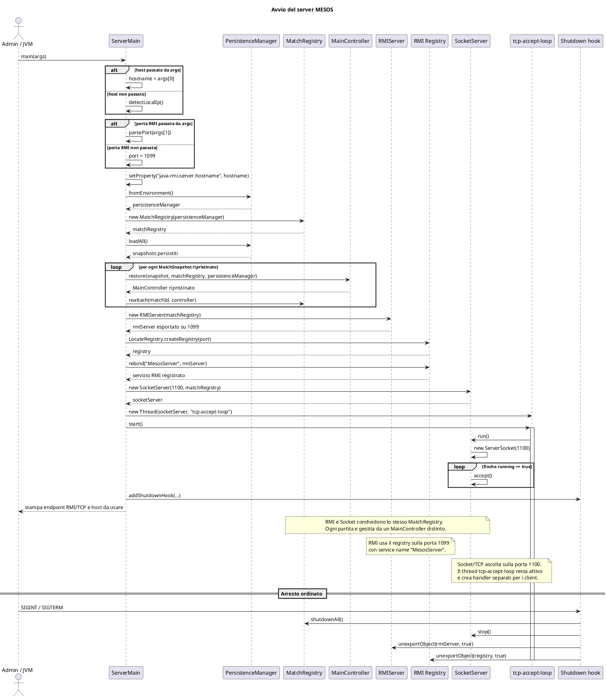

# Diagrammi di sequenza - Network

## Avvio del server

```plantuml
@startuml
title Avvio del server MESOS

actor "Admin / JVM" as Admin
participant "ServerMain" as ServerMain
participant "PersistenceManager" as PM
participant "MatchRegistry" as Registry
participant "MainController" as Match
participant "RMIServer" as RMIServer
participant "RMI Registry" as RMIRegistry
participant "SocketServer" as SocketServer
participant "tcp-accept-loop" as TcpThread
participant "Shutdown hook" as ShutdownHook

Admin -> ServerMain: main(args)

alt host passato da args
    ServerMain -> ServerMain: hostname = args[0]
else host non passato
    ServerMain -> ServerMain: detectLocalIp()
end

alt porta RMI passata da args
    ServerMain -> ServerMain: parsePort(args[1])
else porta RMI non passata
    ServerMain -> ServerMain: port = 1099
end

ServerMain -> ServerMain: setProperty("java.rmi.server.hostname", hostname)

ServerMain -> PM: fromEnvironment()
PM --> ServerMain: persistenceManager

ServerMain -> Registry: new MatchRegistry(persistenceManager)
Registry --> ServerMain: matchRegistry

ServerMain -> PM: loadAll()
PM --> ServerMain: snapshots persistiti

loop per ogni MatchSnapshot ripristinato
    ServerMain -> Match: restore(snapshot, matchRegistry, persistenceManager)
    Match --> ServerMain: MainController ripristinato
    ServerMain -> Registry: reattach(matchId, controller)
end

ServerMain -> RMIServer: new RMIServer(matchRegistry)
RMIServer --> ServerMain: rmiServer esportato su 1099

ServerMain -> RMIRegistry: LocateRegistry.createRegistry(port)
RMIRegistry --> ServerMain: registry

ServerMain -> RMIRegistry: rebind("MesosServer", rmiServer)
RMIRegistry --> ServerMain: servizio RMI registrato

ServerMain -> SocketServer: new SocketServer(1100, matchRegistry)
SocketServer --> ServerMain: socketServer

ServerMain -> TcpThread: new Thread(socketServer, "tcp-accept-loop")
ServerMain -> TcpThread: start()
activate TcpThread
TcpThread -> SocketServer: run()
SocketServer -> SocketServer: new ServerSocket(1100)

loop finche running == true
    SocketServer -> SocketServer: accept()
end

ServerMain -> ShutdownHook: addShutdownHook(...)

ServerMain --> Admin: stampa endpoint RMI/TCP e host da usare

note over Registry,SocketServer
RMI e Socket condividono lo stesso MatchRegistry.
Ogni partita e gestita da un MainController distinto.
end note

note over RMIServer,RMIRegistry
RMI usa il registry sulla porta 1099
con service name "MesosServer".
end note

note over SocketServer,TcpThread
Socket/TCP ascolta sulla porta 1100.
Il thread tcp-accept-loop resta attivo
e crea handler separati per i client.
end note

== Arresto ordinato ==

Admin -> ShutdownHook: SIGINT / SIGTERM
ShutdownHook -> Registry: shutdownAll()
ShutdownHook -> SocketServer: stop()
ShutdownHook -> RMIServer: unexportObject(rmiServer, true)
ShutdownHook -> RMIRegistry: unexportObject(registry, true)
deactivate TcpThread

@enduml
```
